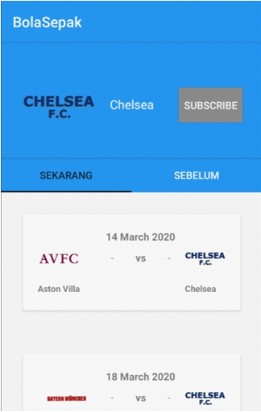

# Tugas Besar 1 IF3210 Pengembangan Aplikasi pada Platform Khusus

## Deskripsi Aplikasi
Hampir semua asisten mata kuliah IF3210 tidak memiliki ketertarikan khusus pada olahraga sepakbola. Untuk memperbaiki kondisi ini, kita berencana untuk membuat sebuah aplikasi bertajuk BolaSepak yang memberikan informasi terkini mengenai sepakbola, tentunya pembuatan aplikasi ini ditugaskan pada peserta mata kuliah IF3210.
 
 
Fitur utama dari BolaSepak adalah memberikan schedule pertandingan sepak bola yang akan datang, dan juga yang sudah lewat. Selain schedule BolaSepak juga perlu menunjukkan lokasi pertandingan sepak bola dan juga cuaca di lokasi pertandingan tersebut. Selain itu pengguna juga dapat melihat profil sebuah tim beserta pertandingan yang pernah dijalani. Pengguna dapat subscribe pada sebuah tim dan akan mendapatkan notifikasi ketika tim tersebut mengikuti pertandingan baru. Selain itu, untuk mendorong asisten mata kuliah IF3210 agar lebih sering berolahraga, aplikasi BolaSepak juga memiliki sebuah step counter untuk menghitung berapa langkah yang telah diambil asisten yang direset setiap harinya.

## Cara Kerja
1. Buka aplikasi. 
2. Di paling atas terdapat step counter. Di bawah step counter ada search. Masukkan nama event yang ingin dicari. 
3. Schedule akan ditampilkan di halaman utama. Ketika schedule ditekan, pengguna akan pindah ke halaman event detail. 
4. Di event detail ketika pertandingan sudah diadakan akan ditampilkan skor, jumlah tembakan, dan para pencetak goal. Untuk pertandingan yang belum diadakan, akan ditampilkan cuaca di lokasi pertandingan jika ada. 
5. Apabila menekan logo tim yang bertanding, pengguna dapat melihat detail pertandingan sebuah tim
6. Pengguna dapat men-subscribe pada sebuah tim sepakbola dengan menekan tombol subscribe
7. Pengguna akan mendapatkan notifikasi jika tim yang di subscribe akan bertanding.  

## Library
Volley untuk melakukan request pada API.  
Room untuk menyimpan data pada sqlite.  

## Screenshot Aplikasi

